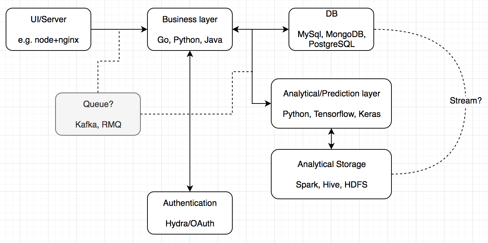

# devEnvMaker
Collection of scripts to create a development envoirnment with containers. Creates a collection of containers that form a basic group of nodes to represent a microservice architecture .

Creates an Linux container with:
- Python
    - Tensorflow
    - Keras
    - pip
    -
- Golang
- Docker & Docker-compose
- Git
- Spark & scala, Java, nodejs, npm, pip, docker-compose,

## Resources
- <https://stackoverflow.com/questions/47536536/whats-the-difference-between-docker-compose-and-kubernetes>
- <https://www.appdynamics.com/blog/product/migrating-from-docker-compose-to-kubernetes/>
- <https://www.youtube.com/watch?v=DiWzujzol70>
- <https://kubernetes.io/docs/tasks/run-application/run-stateless-application-deployment/>
- <https://kubernetes.io/docs/tasks/tools/install-minikube/>
- <https://github.com/nrempel/docker-development-environment>